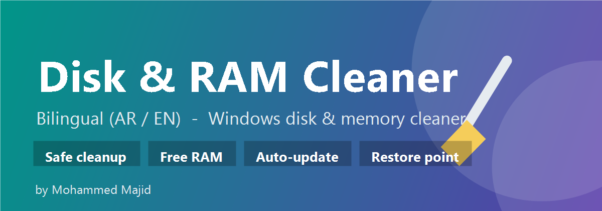

<p align="center">
  
</p>

<p align="center">
  
  
  
  
</p>

# 🧹 Disk & RAM Cleaner

A safe, bilingual (Arabic / English) Windows cleaner that frees disk space and RAM cache — single file, no installation.

أداة تنظيف ويندوز آمنة وثنائية اللغة (عربي / إنجليزي) تحرّر مساحة القرص وكاش الذاكرة — ملف واحد، بدون تنصيب.

**Author / المطوّر:** Mohammed Majid

---

## ✨ Features / المزايا

| English | العربية |
|---|---|
| Analyzes cleanable sizes before deleting | يحلّل الأحجام قبل الحذف |
| Select exactly what to clean | تختار بالضبط شنو تنظّف |
| Frees RAM cache (working sets + standby list) | يحرّر كاش الرام |
| Auto-free RAM every 10 min (optional) | تحرير رام تلقائي كل 10 دقائق |
| Optional restore point before cleaning | نقطة استعادة اختيارية قبل التنظيف |
| Live Arabic / English toggle | تبديل فوري عربي / إنجليزي |
| Remembers your settings | يتذكّر إعداداتك |
| Self-updating from GitHub | تحديث ذاتي من GitHub |
| **Never** touches personal files | **لا يمس** ملفاتك الشخصية |

### Cleans / ينظّف
Temp files · Windows Update cache · Chrome / Edge / Firefox cache · Microsoft Teams · Discord · NVIDIA & DirectX shader cache · thumbnail cache · crash dumps · Recycle Bin · Delivery Optimization.

### Safe by design / آمن بالتصميم
Does **not** touch: Downloads, Documents, Desktop, Pictures, browser bookmarks or saved passwords. Only caches and temporary files are removed.

لا يمس: التنزيلات، المستندات، سطح المكتب، الصور، بوكماركس المتصفح أو كلمات السر المحفوظة.

---

## 🚀 Usage / التشغيل

1. Download `DiskCleaner.exe` from the [latest release](../../releases/latest).
2. Double-click it and approve the admin (UAC) prompt.
3. On first run, if SmartScreen appears → **More info → Run anyway** (the app is unsigned).

نزّل `DiskCleaner.exe` من [آخر إصدار](../../releases/latest)، اضغط عليه دبل-كليك، ووافق على صلاحية الأدمن.

### Verify download / التحقق من الملف
Each release ships a `DiskCleaner.exe.sha256`. Verify with:
```powershell
(Get-FileHash .\DiskCleaner.exe -Algorithm SHA256).Hash
```

---

## 🛠️ Build from source / البناء من المصدر
Requires the [ps2exe](https://www.powershellgallery.com/packages/ps2exe) module:
```powershell
Install-Module ps2exe -Scope CurrentUser
.\build.ps1
```
Or just push a `v*` tag — GitHub Actions builds and publishes the release automatically.

---

## 🔄 Releasing an update / إصدار تحديث
1. Bump the version in `CleanApp.ps1` (`$AppVersion`) and `version.txt`.
2. Commit, then tag and push:
   ```powershell
   git tag v1.5.0
   git push origin v1.5.0
   ```
3. GitHub Actions builds `DiskCleaner.exe` + checksum and attaches them to the release.

Existing users get an in-app notification and can update with one click.

---

## 📄 License / الرخصة
MIT — see [LICENSE](LICENSE).
